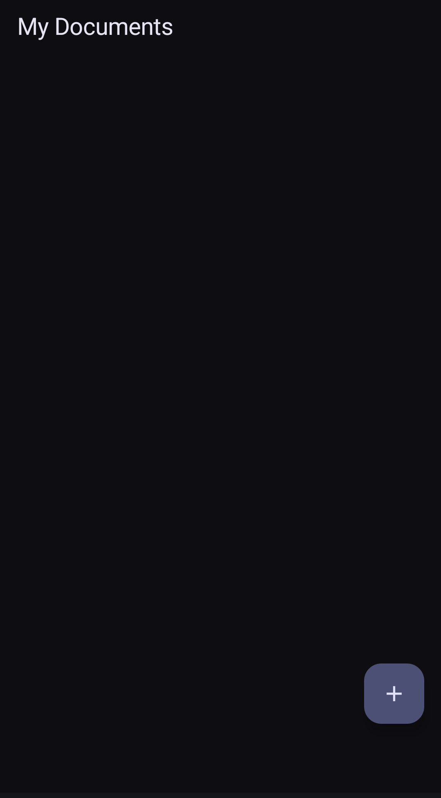
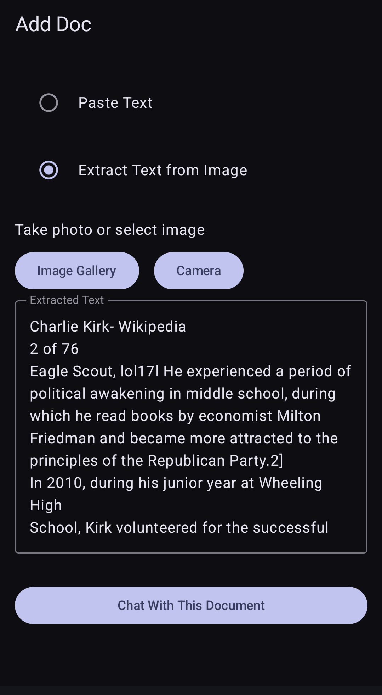
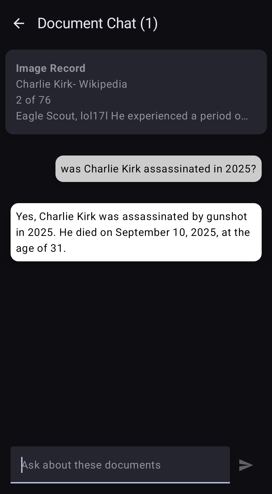

# Doc Chat

Doc Chat is an Android app that allows users to select an image with text, take a photo with text, or paste text and then "chat" with that text document with an OpenAI compatible platform.

---

## 📷 Screenshots

  
  
  

---

## 🚀 Features

- Get text from an image or photo, paste text then chat with it
- Enhanced privacy: Uses temporal in-memory vector database and Retrieval-Augmented Generation (no persistent data stored on device, no data sent to app servers, and only data relevant to your chat is sent to Open AI.

---

## 🛠️ Tech Stack

- **Kotlin**, **LangChain4j** 

---

## Requirements

- Android Studio
- OpenAI API Key 

---

## Build

- Add OpenAI API Key to local.properties ( apiKey="YOUR_API_KEY" )
- Build

---

